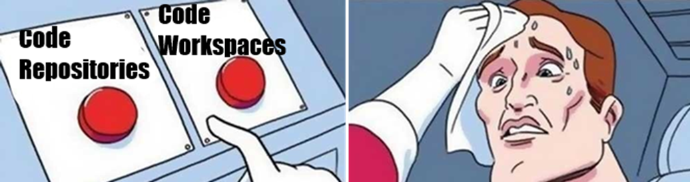
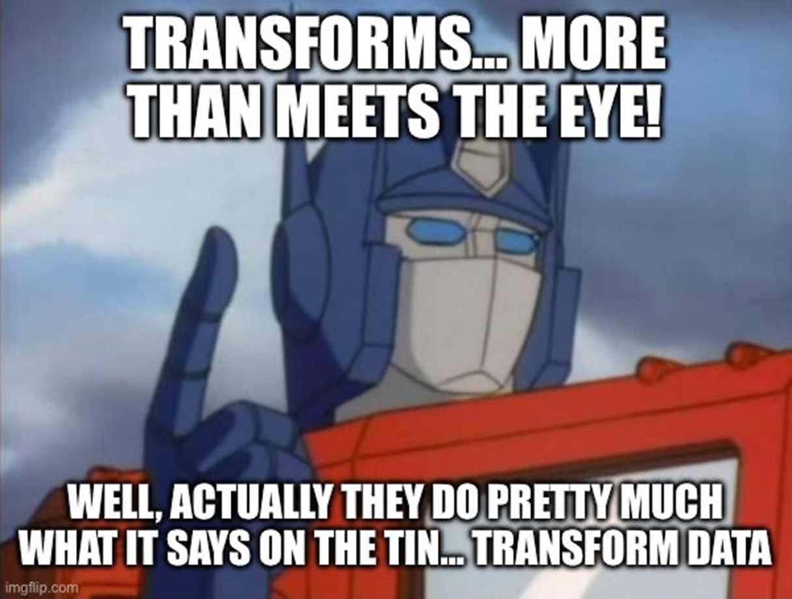

# Data Science Sept 2025 Mini Conference
# FDP - A Simple Transforms Pipeline

You can use the instructions below to follow along with the workshop at your own pace!


## UI - it's all files!


The UI in FDP is file-based (or seems to be)

When you’re working in FDP all your stuff will be in a folder for your project e.g.:

* /super_important_analysis
  * /data
  * code
  * models
  * exploration
  * memes
  * etc.


## Mission 1 - Make folders


Go to the Developer Sandbox, Solex, or any place you have write access to in FDP.

Create a folder structure like this:

* /Tony_Stark
  * /super_important_analyis
  * /data
  * /code

It probably makes sense to replace “Tony_Stark” with your own name.


## Datasets

A Dataset (capital “D”, it’s a thing) in Foundry is appropriately named because this is where data goes. 

A Dataset also manages access control, the schema, version control, metadata etc.

A Dataset can contain tabular or unstructured data (i.e. files)

There is a Python API we can use read and write to Datasets, and convert to Pandas/Spark DFs


# Mission 2 – Make a Dataset


In your /data folder:

1. Click “New”
2. Search for “Dataset”
3. Click “Dataset”
4. Call it anything you want


## Mission 3 – Import some data

Download this sample of artificial HES data:

[Artificial HES APC 2122](/docs/data/artificial_hes_apc_2122.csv)

Back in FDP, go to the Dataset you created and then: 

* Click "Import"
* Add a justifiction (e.g., "artificial data")
* Drag your data into the "Drop files here" box


# Where to write code



* Code Repositories
  * Browser based IDE
  * Lots of Git function accessible here (e.g., merging PRs)
  * Has Spark / parallel processing
  * No command line

* Code Workspaces
  * Analysis focus – Jupyter notebooks
  * Is backed by a Code Repositories! (but notebooks won’t run here)
  * No parallel processing
  * Has command line


# Mission 4 – Create a Code Repository

* Go to your “code” folder
* Click “New”
* Search for “code repository”
* Click “Code Repository”


# Mission 5 – Set up Transforms

When you create a code repository, you get different options

These determine the starting code/boilerplate you get

Steps:

1. Choose “Pipelines”
2. Choose “Python”
3. Give the Code Repo a name
4. Choose “Distributed transform (Spark)”
5. Click "Add" next to the Input Dataset, and choose the one you created earlier
6. Clike "Add" next to the Output Dataset, and choose your "data" folder


# Code Repositories

The Code Repositories UI gives you:

* Git functionality
  * PRs, code review, branching etc.
    * Protect branches
    * Install dependencies
  * Checks
  * Debugger
  * Preview - like display(df)
  * Build – like df.write
  * Scheduling (time, trigger)

You get a lot of hidden files too that are used behind the scenes to make your Code Repository work! 
These get updated automatically by Foundry - just let it do its thing.

Create a branch using the git icon towards the top left of the screen.


# Transforms



Transforms are like the steps or building blocks of a pipeline

Each one typically outputs a new Dataset. So you get a chain of transforms where the input to the next one is the output from the previous one.

For hefty data processing, the Transforms API in Code Repositories is the way to go (to use Spark)

They live in the "datasets" folder by default. You could have a file for each transform in here.


# Transforms - anatomy

There are different types of Transforms. But they have three things in common:

* Imports - you import the relevant packages

* Decorator - to define the input and output datasets

* Compute function - where your data processing actually happens


# Mission 6 - Create our Transform

Use the code below in your spark-transforms.py file.

```py
# These imports should have been auto generated for you
from transforms.api import transform, TransformContext, Input, TransformInput, Output, TransformOutput

# as should the paths to your input and output Datasets (it should have created your output Dataset based on the path and name you gave earlier)
@transform(
    hes=Input("ri.foundry.main.dataset.6f1e7e55-a2bc-44b1-9c38-ab930178c4a4"),
    hes_output=Output("/SOLEX-a8870f/[Learn] Palantir Training/warren.davies/ssp/data/hes_output")
)
def compute(
    ctx: TransformContext, 
    hes: TransformInput, 
    hes_output: TransformOutput
):
    # Convert the hes TransformInput instance into a PySpark DataFrame
    df_input = hes.dataframe()

    # Our PySpark code goes here
    df_output = df_input.limit(1)

    # Pass the result of our DataProcessing to the write_dataframe() method of our TransformOutput instance
    hes_output.write_dataframe(df_output)
```


# Transforms - Running them

* First you'll want to use the "Preview" button on the menu bar near the top


* Through the menu at the bottom you can see checks on your code, test outputs, and outputs from previews and builds

* If it looks OK, then you can click "Build" at the top to actually save the output data to the Dataset


# Seeing the results

* Now go to the Dataset

* You should see your data here

* But note that your data branches too!